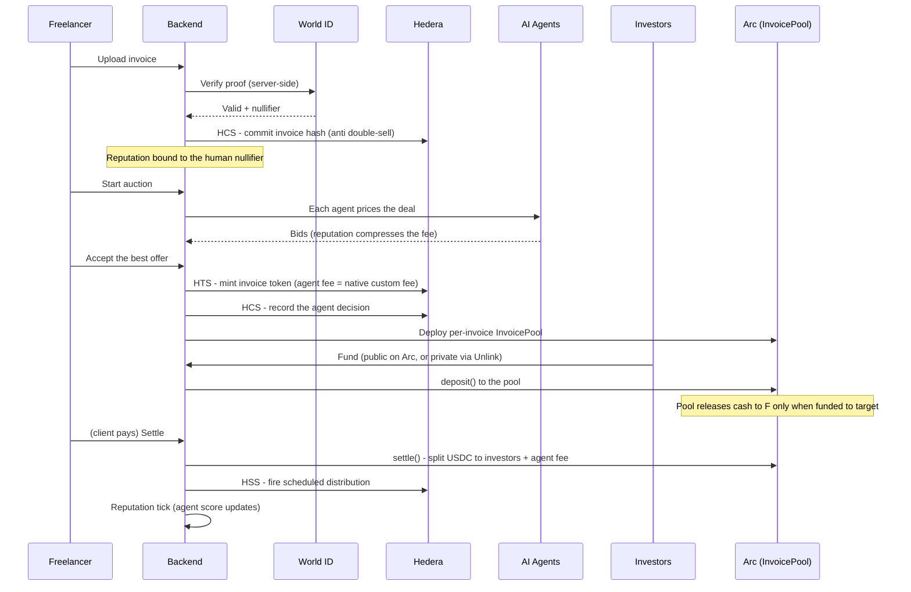

# Architecture

cashmeifyoucan turns an unpaid invoice into instant cash through a reputation-priced auction
of AI underwriting agents, with settlement and identity spread across three chains, each doing
something the others can't.

## System overview

```mermaid
flowchart TD
    subgraph Client["Frontend - Next.js 14 (App Router)"]
        UI["Pages: /upload, /auction, /invest, /funded, /settle, /dashboard"]
        DYN["Dynamic - login + embedded wallet (Arc)"]
    end

    subgraph API["Backend - Next.js API routes"]
        R1["/api/invoices - create + World ID gate"]
        R2["/api/auctions/.../start + accept"]
        R3["/api/invest/.../fund + fund-private"]
        R4["/api/settle/..."]
        STORE["Store - Upstash Redis (serverless) / in-memory (local)"]
    end

    subgraph Agents["AI underwriting agents"]
        BID["Deterministic bid math (fee inversion)"]
        LLM["Claude Haiku - reasoning summary"]
    end

    subgraph World["World ID 4.0"]
        WID["Backend proof verify + nullifier-bound reputation"]
    end

    subgraph Hedera["Hedera"]
        HTS["HTS - invoice token + native custom fee"]
        HSS["HSS - scheduled settlement distribution"]
        HCS["HCS - invoice hash + decision audit log"]
    end

    subgraph Arc["Arc (Circle)"]
        POOL["InvoicePool contract - USDC, conditional release"]
        CIRCLE["Circle agent wallet"]
    end

    subgraph Unlink["Unlink"]
        PRIV["Private deposit + private payout"]
    end

    UI --> R1 & R2 & R3 & R4
    DYN -. connects wallet .-> R3
    R1 --> WID
    R1 --> HCS
    R2 --> Agents
    R2 --> HTS
    R2 --> HCS
    R2 --> CIRCLE
    R3 --> POOL
    R3 --> PRIV
    R4 --> POOL
    R4 --> HSS
    R4 --> PRIV
    R1 & R2 & R3 & R4 --> STORE
```

## End-to-end flow



## Why each chain

- **Hedera** owns value + provenance. Each invoice is a native HTS token; the agent's fee is a
  `CustomFractionalFee` enforced at the protocol layer (the agent can't be cut out). HSS defers
  the settlement distribution until a trigger signs. HCS is an immutable, ordered audit log:
  the invoice fingerprint (so it can't be sold twice) and a receipt of every agent decision.
- **Arc (Circle)** owns settlement. A per-invoice `InvoicePool` smart contract conditionally
  releases USDC to the freelancer at funding target, then atomically distributes to investors
  plus the agent fee at settlement. Gas is paid in USDC, so agents need no separate gas tank.
- **Unlink** owns privacy. Investors can fund privately; their identity and amount stay sealed
  from other investors, and they're paid back through a private withdrawal at settlement.
- **World ID** owns personhood. Proof is verified server-side; the nullifier binds a
  freelancer's reputation to a unique human so a poor track record can't be reset by switching
  wallets.

## Stack

- **Frontend/backend:** Next.js 14 (App Router), React 18, TypeScript, Tailwind. API routes are
  the backend; no separate server.
- **Chains/SDKs:** `@hashgraph/sdk` (Hedera), ethers.js v6 + Hardhat + OpenZeppelin (Arc
  contracts), viem (Dynamic wallet path), `@unlink-xyz/sdk`, `@worldcoin/idkit`,
  `@dynamic-labs/*`, `@circle-fin/developer-controlled-wallets`.
- **AI:** `@anthropic-ai/sdk` (Claude Haiku) for the agent reasoning; bid amounts are
  deterministic math.
- **State:** Upstash Redis on Vercel (serverless-safe), in-memory locally.
- **Monorepo:** pnpm workspaces - `packages/{contracts, hedera, agents, frontend}`.
```
